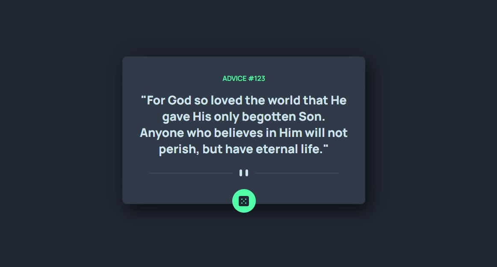

# Advice generator app solution

This is a solution to the [Advice generator app challenge on Frontend Mentor](https://www.frontendmentor.io/challenges/advice-generator-app-QdUG-13db). Frontend Mentor challenges help you improve your coding skills by building realistic projects.

## Table of contents

- [Overview](#overview)
  - [Screenshot](#screenshot)
  - [The challenge](#the-challenge)
  - [Links](#links)
- [My process](#my-process)
  - [Built with](#built-with)
  - [What I learned](#what-i-learned)
- [Author](#author)

## Overview

A simple but yet functional advice (or quote) generator. Just click or tap on the green button and a random advice will replace the previous in the display. It fetches a new advice from the provided api everytime the button is clicked

### Screenshot



### The challenge

Users should be able to:

- View the optimal layout for the app depending on their device's screen size
- See hover states for all interactive elements on the page
- Generate a new piece of advice by clicking the dice icon

### Links

- Solution URL: [https://github.com/itksweb/advice-generator](https://github.com/itksweb/advice-generator)
- Live Site URL: [https://itksweb.github.io/advice-generator](https://itksweb.github.io/advice-generator)
- API used - [https://api.adviceslip.com/advice](https://api.adviceslip.com/advice)

## My process

I started by fleshing out the Jsx component, after which I worked on the styling; thereafter, I coded the logic

### Built with

- HTML5 markup
- CSS Flexbox & Grid
- [React](https://reactjs.org/) - JS library

### What I learned

I got better at styling react components

```js
const fetchNewAdvice = () => {
  fetch("https://api.adviceslip.com/advice")
    .then((respose) => {
      return respose.json();
    })
    .then((data) => {
      const poi = { ...data.slip };
      setAdvice(poi);
    })
    .catch((err) => console.log(err));
  console.log("fetched");
};
```

## Author

- WhatsApp - [Kingsley Ikpefan](https://wa.me/2348060719978)
- LinkedIn - [here](https://www.linkedin.com/in/kingsleyikpefan)
- Frontend Mentor - [@itksweb](https://www.frontendmentor.io/profile/itksweb)
